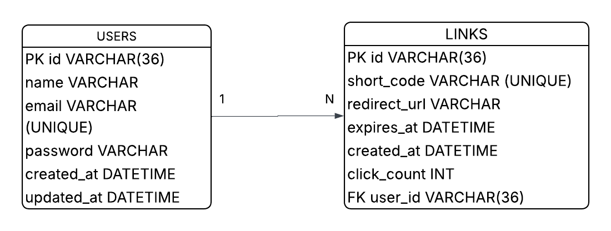
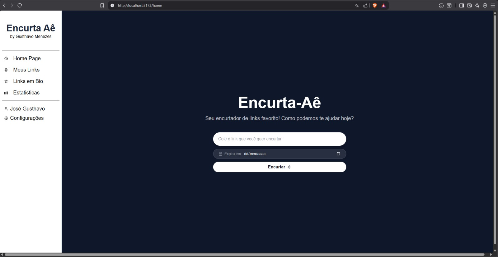
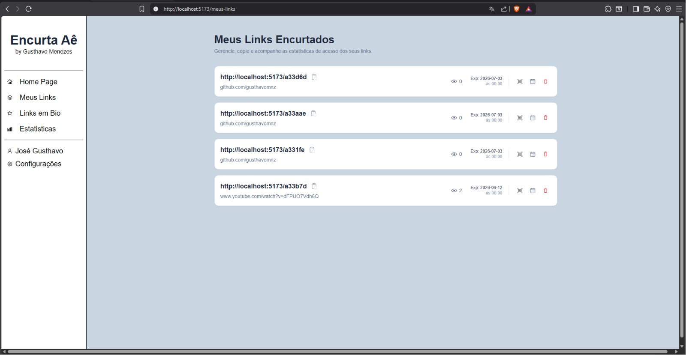

# Encurta-aê 📎

## Encurtador de URLs com autenticação de usuário, controle de expiração e geração de QR Code.

[](https://skillicons.dev)
---

## Sobre o projeto

O **Encurta-aê** é uma aplicação web fullstack de encurtamento de URLs. Usuários autenticados podem criar links curtos com código único, acompanhar todos os links gerados e definir datas de expiração para cada um deles.

O projeto foi desenvolvido com o objetivo de cobrir um fluxo completo de produto: autenticação, persistência de dados, regras de negócio (expiração) e redirecionamento em produção.

---

## Funcionalidades

- **Autenticação** — cadastro e login de usuário com sessão protegida
- **Encurtamento** — geração de código único para cada URL cadastrada
- **Dashboard** — listagem de todos os links criados pelo usuário autenticado
- **Expiração** — edição da data de validade de cada link
- **Redirecionamento** — acesso ao link curto redireciona automaticamente para a URL original
- **QR Code** — geração de QR Code individual para cada link encurtado

---

## Arquitetura

```
encurta-ae/
├── frontend/          # React + TS + Tailwind CSS
└── backend/           # Node.js + TS + Express + Prisma + MySQL
```

A aplicação segue uma arquitetura cliente-servidor desacoplada. O frontend consome a API REST do backend via HTTP, e o banco de dados é gerenciado pelo Prisma ORM.

---

## Diagrama de Entidade e Relacionamento



---

## Screenshots





[ Outras telas ainda em Desenvolvimento...]
---

Feito por **Gusthavo Menezes** — [Confira meu LinkedIn](https://www.linkedin.com/in/gusthavomnz) ·